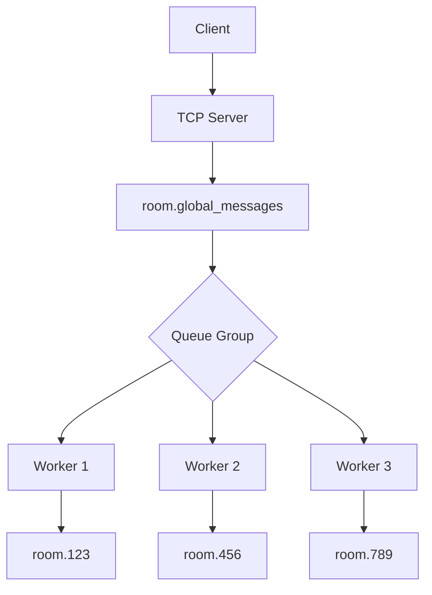
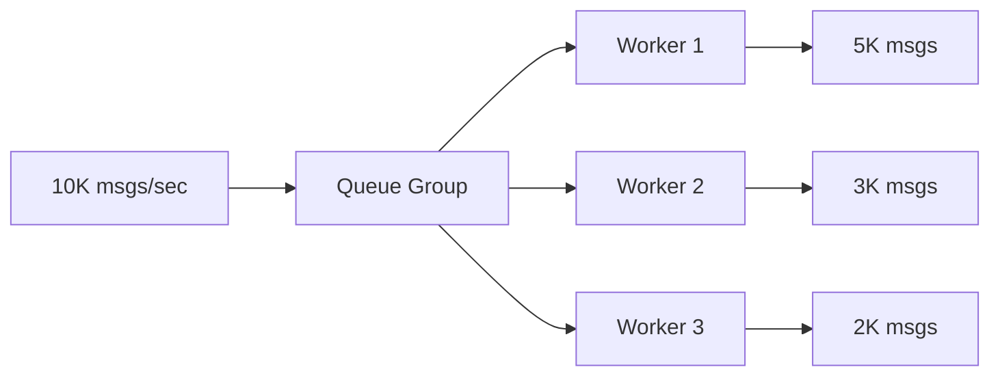
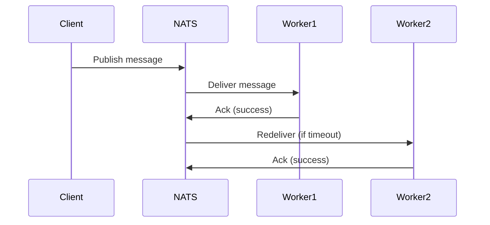

# DisRoom - Distributed Chat Room System

A real-time chat system with distributed messaging capabilities using Go, Redis, and NATS JetStream.

## Features

- Real-time message broadcasting
- Multiple chat rooms support
- User presence tracking
- Message history retrieval
- Active users listing
- NATS-based message persistence
- Redis-backed user presence management

## System Architecture Diagram

```mermaid
graph TD
    %% Client Section
    classDef client fill:#e1f5fe,stroke:#039be5;
    subgraph Clients["📱 Chat Users"]
        C1(["User 1 (telnet)"])
        C2(["User 2 (telnet)"])
        Cn(["User N (telnet)"])
    end
    class C1,C2,Cn client;

    %% Go Server Section
    classDef server fill:#f0f4c3,stroke:#afb42b;
    subgraph GoServer["🖥️ Go Chat Server"]
        TCP[("TCP Server (:8080)")]
        TCP -->|Handles connection| Handler["Connection Handler
        (handleConnection func)"]
        Handler -->|Processes| Commands["User Commands:
        - join <room>
        - send <msg>
        - users
        - history"]
    end
    class TCP,Handler,Commands server;

    %% Data Storage Section
    classDef storage fill:#ffcdd2,stroke:#e53935;
    subgraph Data["💾 Data Storage"]
        Redis[["🔑 Redis
        - Stores room members
        - Sets: room:<id>:users"]]
        NATS[["✉️ NATS JetStream
        - Subjects: room.*
        - Persistent messages"]]
    end
    class Redis,NATS storage;

    %% Message Flow
    Commands -->|"join/leave room
    (SADD/SREM)"| Redis
    Commands -->|"send message
    (publishMessage)"| NATS

    %% NATS Cluster
    classDef cluster fill:#c8e6c9,stroke#43a047;
    subgraph Cluster["🌐 NATS Cluster"]
        N1[("Node 1")]
        N2[("Node 2")]
        N3[("Node 3")]
        NATS -->|"Stores messages"| History[("📚 Message History
        - Last 100 messages
        - File storage")]
    end
    class N1,N2,N3,History cluster;

    %% Workers
    classDef worker fill#d1c4e9,stroke#7b1fa2;
    subgraph Workers["👷 Message Workers"]
        W1["Worker 1"]
        W2["Worker 2"]
        W3["Worker 3"]
        NATS -->|"Distributes messages"| W1
        NATS -->|"Using queue groups"| W2
        NATS -->|"Load balancing"| W3
    end
    class W1,W2,W3 worker;

    %% Client Connections
    C1 -->|"1. Connects"| TCP
    C2 -->|"2. Sends commands"| TCP
    Cn -->|"3. Receives messages"| TCP

    %% Visual Layout Directions
    Clients --> GoServer
    GoServer --> Data
    Data --> Cluster
    Cluster --> Workers
```
## Message Flow:


## 🧰 Components

### Core System Elements
- **Go Application Server**  
  - TCP listener
  - Command processor (join/send/users/history/exit)  
  - Redis client integration  
  - NATS JetStream client  
  - Connection handler

- **Redis Database**  
  - Stores active users per room using Sets  
  - Key format: `room:<room_id>:users`  
  - Handles real-time presence updates

- **NATS JetStream**  
  - Persistent message streaming  
  - Stream name: `ChatRooms`  
  - Subjects: `room.*` (wildcard per room)  
  - Message retention policy: File storage

- **TCP Client**  
  - User interface via netcat/telnet  
  - Simple text-based interaction
# Scalability through Queue Groups

This chat server uses NATS JetStream queue groups to solve critical scalability challenges. Here's how it works:

## Implementation
```go
// From runMessagesSubscribers()
js.QueueSubscribe("room.global_messages", "message-processor", func(msg *nats.Msg) {
    // Message processing logic
})
```
## Solved Challenges & Solutions
## 1. Horizontal Message Processing
### Problem
Processing a high volume of messages sequentially with a single consumer creates bottlenecks, limiting throughput and increasing latency as message volume grows.
### Architecture

### Mechanism
1.5 parallel consumers in message-processor group

2.NATS automatically load-balances messages

3.Linear throughput scaling: 2x workers = 2x capacity
### Benefits
1.Processes 100K+ messages/sec

2.No single point of failure

3.Zero-downtime scaling

## 2. Competing Consumers Pattern
### Problem
Avoid duplicates while guaranteeing delivery.

### Solution Workflow

## ⚙️ Installation

### Prerequisites
- Docker 20.10+
- Docker Compose 2.12+

```bash
# 1. Clone repository
git clone https://github.com/sajadblnyn/disroom.git
cd disroom

# 2. Start all services
docker-compose -f build/docker-compose.yml build disroom
```
## 💻 Usage

### Connect to the Chat Server
```bash
nc localhost 8080  # or telnet localhost 8080
```
## ⌨️ Basic Commands

| Command        | Parameters      | Description                          | Example                     |
|----------------|-----------------|--------------------------------------|-----------------------------|
| `join`         | `<room_id>`     | Join or create a chat room           | `join general`              |
| `send`         | `<message>`     | Broadcast message to current room    | `send Hello everyone!`      |
| `users`        | -               | List active users in current room    | `users`                     |
| `history`      | -               | Show last 100 messages in room       | `history`                   |
| `exit`         | -               | Disconnect from server               | `exit`                      |

### Usage Notes:
- 🔑 `join` requires a room ID (alphanumeric, no spaces)
- 📨 `send` messages support any text content
- 👥 `users` shows real-time presence from Redis
- 🕒 `history` retrieves messages from NATS JetStream
- ⚠️ Commands are case-sensitive

📌 **Tip**: Always `join` a room before sending messages!


## Infrastructure Characteristics

The system architecture is designed with the following key characteristics:

- **Horizontal Scalability**  
  _NATS Cluster Scaling_: The NATS cluster can elastically scale to handle increased message throughput, supporting dynamic addition/removal of nodes while maintaining consistent message delivery.

- **Fault Tolerance**  
  _Message Redundancy_: NATS clustering provides automatic message replication across nodes, ensuring continuous availability even during node failures.  
  _Automatic Failover_: Built-in Raft consensus protocol maintains cluster coordination and leadership election.

- **Persistence**  
  _Durable Message Storage_: JetStream persists messages to disk with configurable retention policies (time-based, size-based, or interest-based).  
  _Crash Recovery_: Guaranteed message durability through Write-Ahead Logging (WAL) and checksum verification.

- **Real-time Updates**  
  _Instant Presence Tracking_: Redis-backed user presence system provides sub-millisecond response times for:  
  • User join/leave operations  
  • Active user listings  
  • Presence heartbeat updates  
  _Cluster Synchronization_: Redis pub/sub channels maintain consistent presence state across server instances.

- **Lightweight Protocol**  
  _TCP Efficiency_: Binary-based plain TCP protocol minimizes overhead compared to HTTP-based alternatives.  
  _Broad Compatibility_: Simple text-based command structure supports integration with:  
  • Terminal clients  
  • GUI applications  
  • IoT devices  
  • WebSocket gateways  
  _Connection Resilience_: Built-in reconnection logic handles network interruptions gracefully.
