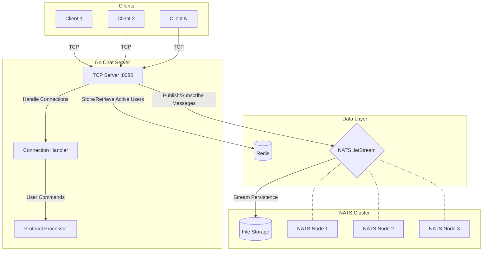

# DisRoom - Distributed Chat Room System

A real-time chat system with distributed messaging capabilities using Go, Redis, and NATS JetStream.

## Features

- Real-time message broadcasting
- Multiple chat rooms support
- User presence tracking
- Message history retrieval
- Active users listing
- NATS-based message persistence
- Redis-backed user presence management

## System Architecture Diagram

## Infrastructure Characteristics

The system architecture is designed with the following key characteristics:

- **Horizontal Scalability**  
  _NATS Cluster Scaling_: The NATS cluster can elastically scale to handle increased message throughput, supporting dynamic addition/removal of nodes while maintaining consistent message delivery.

- **Fault Tolerance**  
  _Message Redundancy_: NATS clustering provides automatic message replication across nodes, ensuring continuous availability even during node failures.  
  _Automatic Failover_: Built-in Raft consensus protocol maintains cluster coordination and leadership election.

- **Persistence**  
  _Durable Message Storage_: JetStream persists messages to disk with configurable retention policies (time-based, size-based, or interest-based).  
  _Crash Recovery_: Guaranteed message durability through Write-Ahead Logging (WAL) and checksum verification.

- **Real-time Updates**  
  _Instant Presence Tracking_: Redis-backed user presence system provides sub-millisecond response times for:  
  • User join/leave operations  
  • Active user listings  
  • Presence heartbeat updates  
  _Cluster Synchronization_: Redis pub/sub channels maintain consistent presence state across server instances.

- **Lightweight Protocol**  
  _TCP Efficiency_: Binary-based plain TCP protocol minimizes overhead compared to HTTP-based alternatives.  
  _Broad Compatibility_: Simple text-based command structure supports integration with:  
  • Terminal clients  
  • GUI applications  
  • IoT devices  
  • WebSocket gateways  
  _Connection Resilience_: Built-in reconnection logic handles network interruptions gracefully.
