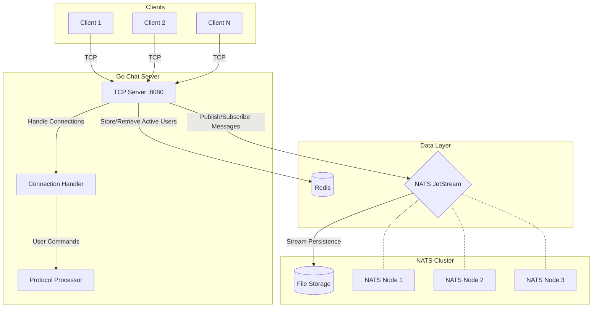

# DisRoom - Distributed Chat Room System

A real-time chat system with distributed messaging capabilities using Go, Redis, and NATS JetStream.

## Features

- Real-time message broadcasting
- Multiple chat rooms support
- User presence tracking
- Message history retrieval
- Active users listing
- NATS-based message persistence
- Redis-backed user presence management

## System Architecture Diagram

System Architecture Overview
Key Components:
TCP Server (Port 8080)

Handles client connections

Manages network I/O

Routes commands to protocol processor

Connection Handler

Manages per-connection state

Maintains user sessions

Coordinates with Redis and NATS

Protocol Processor

Implements command parsing

Executes business logic for:

Room management

Message handling

User presence tracking

Redis Database

Stores active users per room using Sets

Tracks real-time presence status

Provides fast membership lookups

NATS JetStream Cluster

3-node clustered messaging system

Persistent message storage

Provides:

Real-time message distribution

Historical message retention

Presence notification channel

Key Data Flows:
Client Connection

Clients establish TCP connections to port 8080

Text-based command protocol for interaction

Room Management

JOIN commands update Redis user sets

Periodic presence updates via NATS

Automatic cleanup on disconnect

Message Flow

Messages published to room-specific NATS subjects

JetStream persists messages to disk

Subscribers receive real-time updates

History Retrieval

JetStream stream consumers fetch historical messages

Ordered message replay from persistence layer

Infrastructure Characteristics:
Horizontal Scalability: NATS cluster can scale to handle increased message throughput

Fault Tolerance: NATS clustering provides message redundancy

Persistence: JetStream ensures message durability with file storage

Real-time Updates: Redis enables instant presence tracking

Lightweight Protocol: Simple TCP-based communication for broad client compatibility
